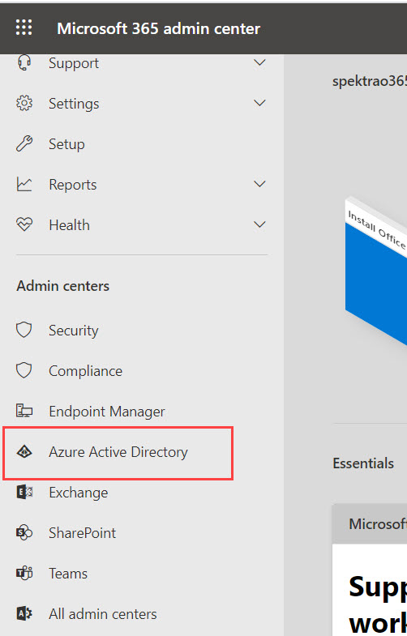
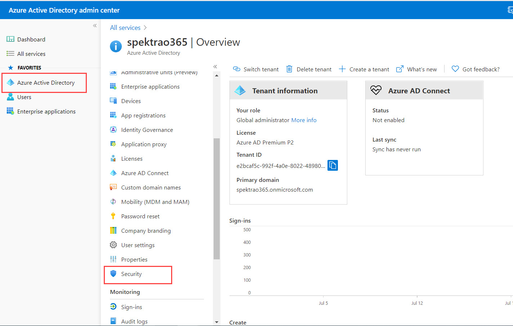
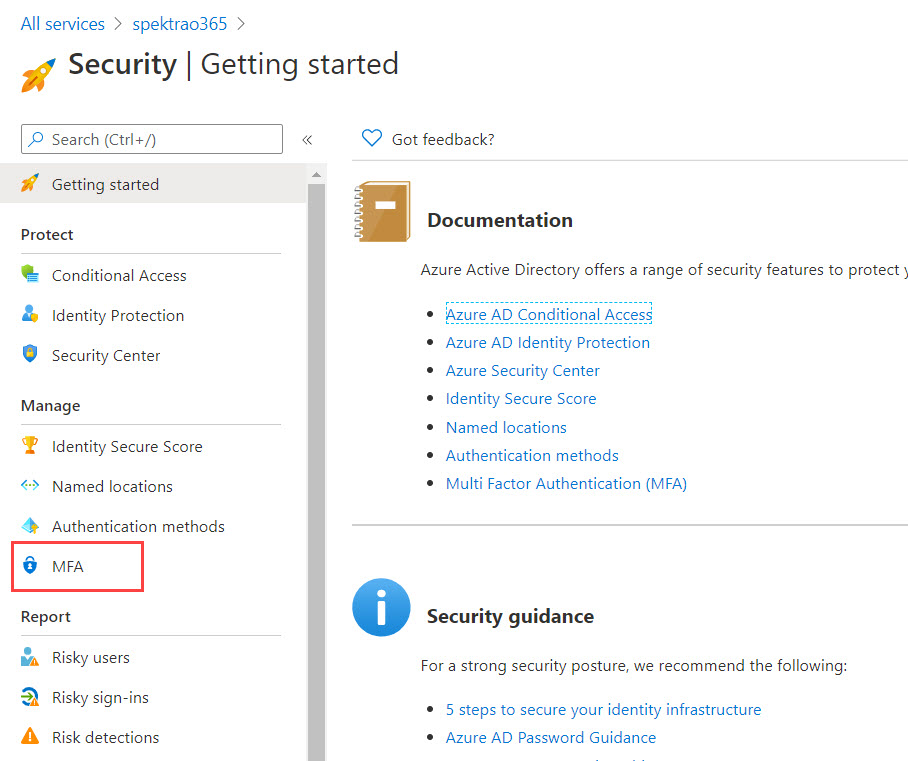

## Exercise 3 : Secure Access to Teams

### Task 1 : Implement MFA with Conditional Access policies for end users

To configure MFA, Select Azure Active Directory under Admin Centers

<kbd></kbd>

In Azure select Azure Active Directory and then select Security

<kbd></kbd>

Now select MFA

<kbd></kbd>

https://docs.microsoft.com/en-us/microsoft-365/admin/security-and-compliance/set-up-multi-factor-authentication?view=o365-worldwide

### Task 2 : Implement SSPR

<kbd></kbd>

https://docs.microsoft.com/en-us/microsoft-365/admin/add-users/let-users-reset-passwords?view=o365-worldwide
