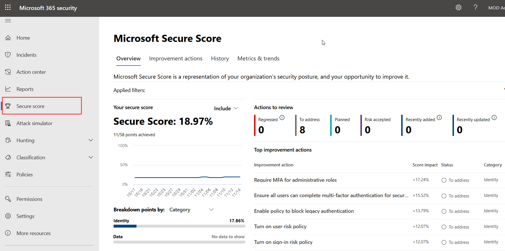
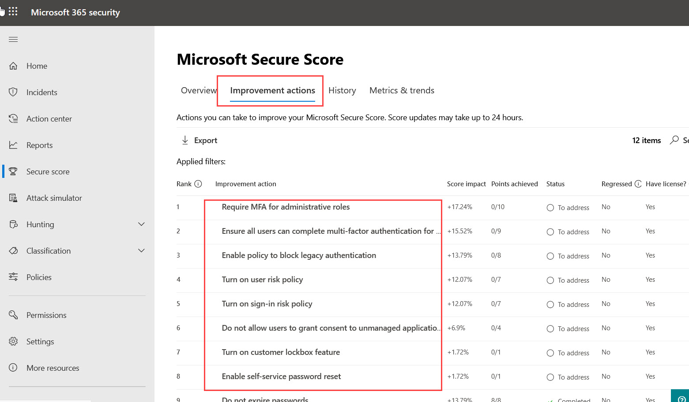

## Identity Workshop

In this lab we are going to learn:

• **Microsoft Secure Score** : Microsoft Secure Score is a measurement of an organization's security posture, with a higher number indicating more improvement actions taken. It can be found at https://security.microsoft.com/securescore in the Microsoft 365 security center.
Following the Secure Score recommendations can protect your organization from threats. From a centralized dashboard in the Microsoft 365 security center, organizations can monitor and work on the security of their Microsoft 365 identities, data, apps, devices, and infrastructure.

Secure Score helps organizations to:

Report on the current state of the organization's security posture.
Improve their security posture by providing discoverability, visibility, guidance, and control.
Compare with benchmarks and establish key performance indicators (KPIs).

•	**Self-Service Password Reset (SSPR)** – As the Microsoft 365 admin, you can let people use the self-service password reset tool so you don't have to reset passwords for them. Less work for you!

•	**Multifactor Authentication (MFA)** – To provide an additional level of security for sign-ins, you must use multi-factor authentication (MFA), which uses both a password, which should be strong, and an additional verification method based on:
    * Something you have with you that is not easily duplicated, such as a smart phone.
    * Something you uniquely and biologically have, such as your fingerprints, face, or other biometric attribute.
The additional verification method is not employed until after the user's password has been verified. With MFA, even if a strong user password is compromised, the attacker does not have your smart phone or your fingerprint to complete the sign-in.

•	**Conditional Access Policy** - The modern security perimeter now extends beyond an organization's network to include user and device identity. Organizations can utilize these identity signals as part of their access control decisions.
Conditional Access is the tool used by Azure Active Directory to bring signals together, to make decisions, and enforce organizational policies. Conditional Access is at the heart of the new identity driven control plane.

•	**Azure AD Application Management (SHA and SSO)** - Azure Active Directory is an Identity and Access Management (IAM) system. It provides a single place to store information about digital identities. You can configure your software applications to use Azure AD as the place where user information is stored.
Azure AD must be configured to integrate with an application. In other words, it needs to know what applications are using it as an identity system. The process of keeping Azure AD aware of these applications, and how it should handle them, is known as application management.
You manage applications on the Enterprise applications blade located in the Manage section of the Azure Active Directory portal.

## Check Microsoft Secure Score 

Navigate to https://security.microsoft.com and login with the admin credentials provided to you.

<kbd></kbd>

Once you successfully login, select **Security Score** in the menu bar availabe in the left hand side to see all the Security Score related details of your tenant.

<kbd></kbd>

After exploring all the details provided in the **overview** tab, select **Improvement actions** tab to see all the available options for improving our security score.

<kbd></kbd>

Now we are going to implement couple of these improvemnt actions.

## Configure Self-Service Password Reset (SSPR)

Follow the below steps to turn on self-service password reset for everyone in your Organization.

Navigate to https://admin.microsoft.com to open **Microsoft 365 Admin Center** and login with the admin credentials provided to you.

In the admin center, go to the **Settings** > **Org settings** page.

At the top of the Org settings page, select the **Security & Privacy** tab.

Select **Self-service Password Reset**.

<kbd></kbd>

Under Self-service password reset, select **Go to the Azure portal to turn on self-service password reset**.

In the left navigation pane, select **User**s, and then, on the **Users | All users** page, select **Password reset**.

On the Properties page, **select All** to enable it for everyone in your business, and then select **Save**.

When your users sign in, they will be prompted to enter additional contact information that will help them reset their password in the future.

## Configure Multi-factor Authentiacation & Conditional Access policy

First, create a Conditional Access policy and assign your group of users as follows:

Sign-in to https://admin.microsoft.com and open **Azure Active Directory** Admin Center from **All Admin Centers**.

Select **Azure Active Directory**.

Select **Conditional Access**, then choose **+ New policy**.

Enter a name for the policy, such as MFA Pilot.

Under **Assignment**s, choose **Users and groups**, then the Select users and groups radio button.

Check the box for **Users and groups**, then Select to browse the available Azure AD users and groups.

Browse for and select your newly created Azure AD group, then choose **Select**.

Select your Azure AD group to use with the Conditional Access policy

To apply the Conditional Access policy for the group, select **Done**.

**Configure the conditions for multi-factor authentication**

With the Conditional Access policy created and a test group of users assigned, now define the cloud apps or actions that trigger the policy. These cloud apps or actions are the scenarios you decide require additional processing, such as to prompt for MFA. For example, you could decide that access to a financial application or use of management tools requires as an additional verification prompt.

For this tutorial, configure the Conditional Access policy to require MFA when a user signs in to the Azure portal.

Select Cloud apps or actions. You can choose to apply the Conditional Access policy to All cloud apps or Select apps. To provide flexibility, you can also exclude certain apps from the policy.

For this tutorial, on the Include page, choose the **Select apps** radio button.

Choose **Select**, then browse the list of available sign-in events that can be used.

For this tutorial, choose **Microsoft Azure Management** so the policy applies to sign-in events to the Azure portal.

To apply the select apps, choose **Select**, then **Done**.

Select the **Microsoft Azure Management** app to include in the Conditional Access policy

Access controls let you define the requirements for a user to be granted access, such as needing an approved client app or using a device that's Hybrid Azure AD joined. In this tutorial, configure the access controls to require MFA during a sign-in event to the Azure portal.

Under **Access controls**, choose **Grant**, then make sure the **Grant access** radio button is selected.
Check the box for **Require multi-factor authenticatio**, then choose **Select**.
Conditional Access policies can be set to Report-only if you want to see how the configuration would impact users, or Off if you don't want to the use policy right now. As a test group of users was targeted for this tutorial, lets enable the policy and then test Azure Multi-Factor Authentication.

Set the **Enable policy** toggle to **On**.
To apply the Conditional Access policy, select **Create**.

**Test Azure Multi-Factor Authentication**

Let's see your Conditional Access policy and Azure Multi-Factor Authentication in action. First, sign in to a resource that doesn't require MFA as follows:

Open a new browser window in InPrivate or incognito mode and browse to https://account.activedirectory.windowsazure.com
Sign in with your non-administrator newly created user user, such as testuser. There's no prompt for you to complete MFA.
Close the browser window.
Now sign in to the Azure portal. As the Azure portal was configured in the Conditional Access policy to require additional verification, you get an Azure Multi-Factor Authentication prompt.

Open a new browser window in InPrivate or incognito mode and browse to https://portal.azure.com.

Sign in with your non-administrator test user, such as testuser. You're required to register for and use Azure Multi-Factor Authentication. Follow the prompts to complete the process and verify you successfully sign in to the Azure portal.

Follow the browser prompts and then on your registered multi-factor authentication prompt to sign in

Close the browser window.

